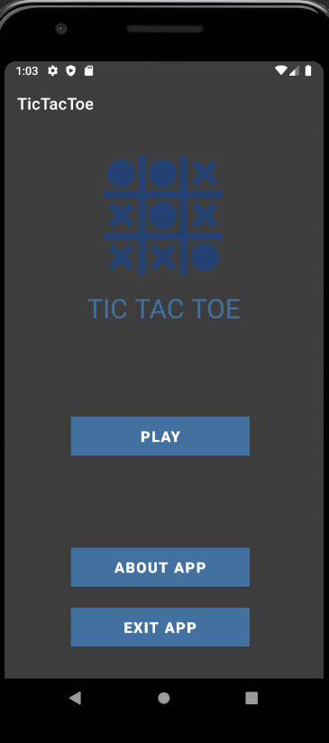

<h1 align="center">
   
</h1>
 

  <a href="#-projeto">Project</a>&nbsp;&nbsp;&nbsp;|&nbsp;&nbsp;&nbsp;
  <a href="#-tecnologias">Technologies</a>&nbsp;&nbsp;&nbsp;|&nbsp;&nbsp;&nbsp;
  <a href="#-usage">Usage</a>&nbsp;&nbsp;&nbsp;|&nbsp;&nbsp;&nbsp;
  <a href="#-participants">Participants</a>

 

## 💻 Project

🎲 TicTacToe was an app made with Java for Android. 🎲

    

## 🚀 Technologies

This project was developed with the following technologies:

- [Java](https://developer.android.com/studio/write/java8-support?hl=pt-br)

## 💻 Usage

 ### Mobile App
  
    Just open the project on android studio and run. 💜
    

## 👥 Participants

[Samuel Formigheri](https://github.com/SamuelFormigheri)